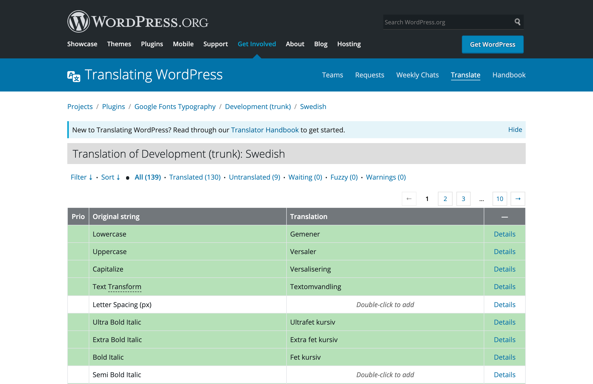

# Contributing

To contribute translations you first need a (free) WordPress.org account. If you don't already have one you can create one here: [https://login.wordpress.org/register](https://login.wordpress.org/register)

There are two ways you can translate the plugin. You can translate the plugin itself or you can translate the 'Readme'. The Readme is used to generate the WordPress.org plugin page.

Both types of translation are equally important and we are grateful for contributions to either. Plugin translations help non-English speaking users use the plugin and readme translations help them discover and understand the plugin in the first place.

To begin contributing translations, go here and find your language:

[https://translate.wordpress.org/projects/wp-plugins/olympus-google-fonts/](https://translate.wordpress.org/projects/wp-plugins/olympus-google-fonts/)

The relevant fields are the first two, they represent the plugin and readme's translation status. A value of 0% means no strings have been translated and 100% means that all strings have been completed.

.png>)

To begin adding translations, click either the first (Plugin) or second (Readme) field next to your language.

Rows that are green already have approved translations.

To add a translation simply double click the empty field and enter your translation in the area provided. Then press the blue button to submit.

.png>)

Repeat the process for the remaining strings.

Once you submit a translation it will be placed in "Waiting" status (orange).

.png>)

Email us ([team@fontsplugin.com](mailto:team@fontsplugin.com)) to let us know your translations are waiting and we will work with the translation editors to approve the contributions. This process exists to remove the possibility of malicious or erroneous translations.
